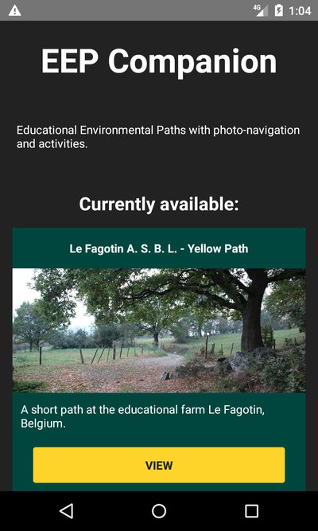
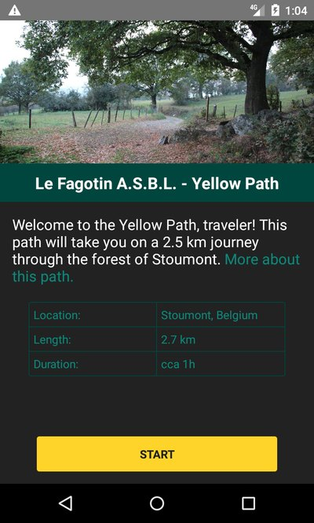
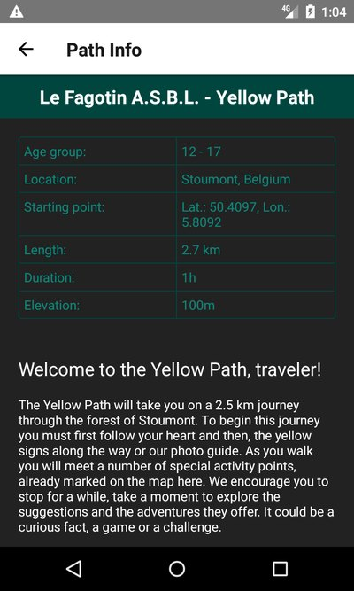
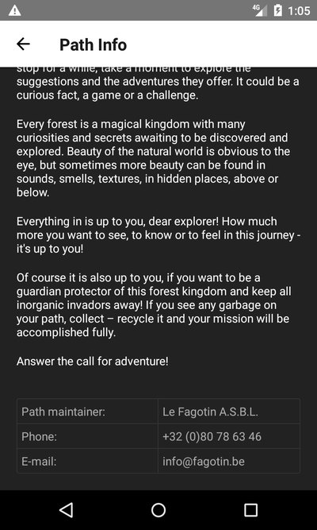
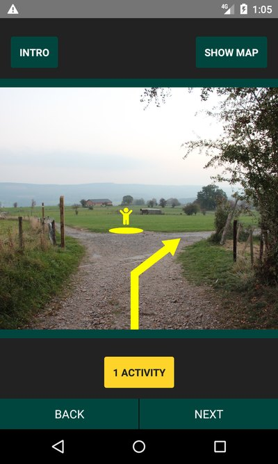
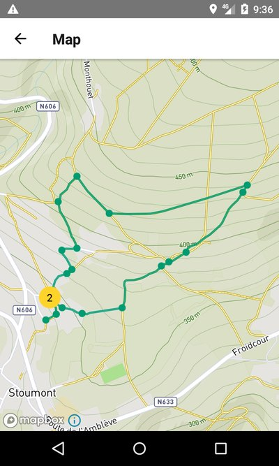
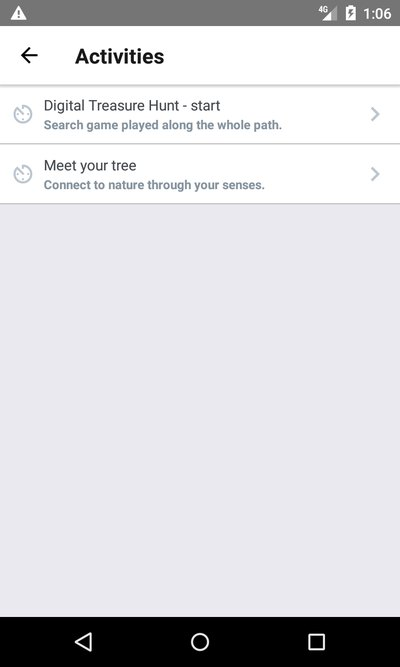
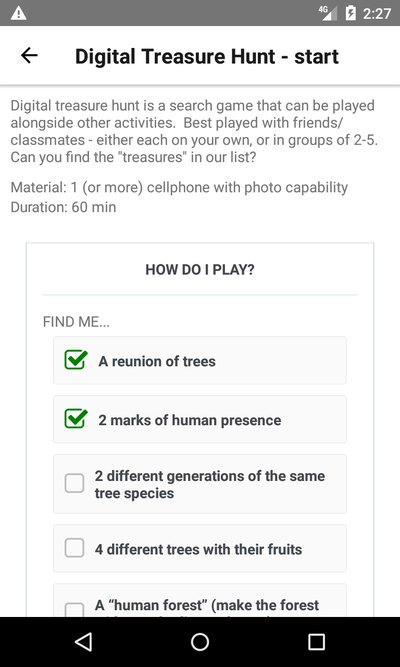
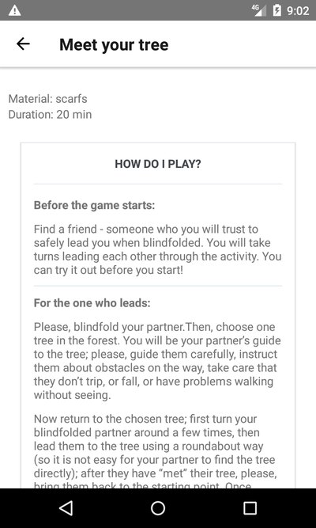

# EEP Companion
EEP Companion is a mobile app companion for an *educational environmental path* located in Stoumont, Belgium. It is a proof-of-concept prototype created for the "ORA: Non Formal Environmental Education to enhance youth inclusion" project.

The goal of the project is to explore the options of using mobile technology to solve specific problems of EEPs, and publish the resulting code and findings for use by other educational ecology organizations.

Environmental educational materials previously created by ORA:\
http://oranetwork.eu/index.php/131.html\
http://oracapacitybuilding.weebly.com/resources.html

### Table of Contents
[Situation](#situation)
: [Our suggested solution](#our-suggested-solution)

[Planning](#planning)
: [Expectations](#expectations)
: [Requirements](#requirements)
: [Chosen technology](#chosen-technology)

[Implementation](#implementation)
: [1. Le Fagotin](#1-le-fagotin)
: [2. Berlin](#2-berlin)
: [Missing functionality](#missing-functionality)

[Presentation notes](#presentation-notes)
: 

[Conclusion](#conclusion)
: [Option 1: App as a service](#option-1-app-as-a-service)
: [Option 2: Web app](#option-2-web-app)
: [Other recommendations](#other-recommendations)

[App documentation](#app-documentation)
: [Dev dependencies](#dev-dependencies)
: [Installation](#installation)
: [Running the code](#running-the-code)
: [Known issues](#known-issues)
: [License](#license)
: [Screenshots](#screenshots)

[Credits](#credits)
: [Creators](#creators)

---

## Situation
Le Fagotin A.S.B.L. already maintains two paths through nearby woods, which it uses for activities with visitors. There are several problems with the path as it exists now:

1. Due to municipality requirement, the paths cannot be physically marked and the environment may not be modified in any permanent way.
2. The farm lends its visitors a path guide with a map and photos with arrows that help navigate the path. The path guide is used only in print form and isn't available when the farm is not open.
3. The path doesn't include any activities for the visitors.

In addition to this, the farm would like to tailor the path better to its older visitors, between 12- 17 years.

### Our suggested solution
Although these problems could be addressed separately, we thought that a mobile application would be a good fit. It would be non-physical and would be accessible even out of the farm's working hours. It could be used not only to navigate the path, but also to supply additional educational materials. And last but not least, it might appeal to teenagers. We know they will be using their phones anyway, went our thinking. So why not put something relevant *on* their phones?

## Planning

### Expectations
Realistically, the first prototype won't be ready for actual use by the farm. Instead, the aim was to explore the options and suggest how it could be done, in regards to both the technology and the infrastructure/maintenance. I have come up with with three hypothetical scenarios:

**Volunteer project.** The organization would find a volunteer with necessary skills to build and maintain the application.

**Outsourced project.** The organization would find a contractor and finance the project somehow, for example through applying for a grant.

**Shared service project.** The developed application would be modular or easily extended. It would be developed by one organization and offered to others. The development itself would be either volunteer-based or outsourced; the costs could be shared between organizations or covered by one "supplier" organization.

### Requirements
Based on the goals and expectations, the requirements on the technology stack are these:

* **Should run offline.** The app will contain images, and it's not likely that all visitors will have (or want to use) mobile data. This strikes out the option to build a mobile-optimized website.
* **Should be interactive.** Therefore, no pdf/other static document.
* **Should be cross-platform.**
* **Should be easily accessible by novice developers**, or otherwise very popular. The reason for this is simple - the more people can work with the technology (or could easily learn), the more easier it is to find either volunteers or cheap development studios to create the app.

### Chosen technology
Based on these requirements, I have chosen React Native developed using the Expo framework. It can produce natively-running, cross-platform applications, and due to its design should be accessible to a larger number of developers than other options (I assume there is more web developers than, for example,  Java developers, especially among beginners).
In regards of the packages used, I have made only two significant choices: `react-native-navigation` for screen navigation and `react-native-mapbox-gl` for maps. It was necessary to use OpenStreetMaps, and unfortunately there is no other package than Mapbox at the moment.

## Implementation
The app was developed in two phases:

1. Le Fagotin (October 2018) - content, basic architecture decisions for the app, first prototype
2. Berlin (December 2018 - February 2019) - final prototype, design, architecture, technology decisions, documentation

### 1. Le Fagotin 
The content and the initial work on the app was done during our stay on the animation farm Le Fagotin. We worked on location, walking the path many times, collecting information, planning and testing the activities. Here we have also designed the activities and created other material for the app, for example the introductory text (written by Reni Grueva).

From the technology side of the project, Branislav and me have discussed the application functionality and minimal requirements. Afterwards I have created a basic functionality checklist and a diagram of the necessary screens.

Unfortunately, I have almost immediately encountered technical problems. The Expo framework, if testing on physical device as recommended by the tutorials, requires stable and strong wi-fi connection. There is no tethering option, use of emulator is buggy and badly documented.

Aside from development environment issues, I ran into framework capability issues too. The way the navigation steps need to be served is incompatible with Expo asset packager. Trying to design around this would either require literally making a separate file for each step (which is nonsense, obviously), or preload the images somehow so the packager would do its job.

React Native + Expo stack is very hard to debug. The error messages are not as bad as they could be (especially on the React Native end), but the fact remains that when one thing doesn't behave as it should, there is literally a chain of potential points of failure: the code, the packages, the Expo local runner, Expo packager, Expo upload to server, download to the Expo app, the Expo app itself, and last but not least the Android system. 

In the end, I was not able to present the initial prototype, despite having finished it on time.

### 2. Berlin
After my problems with Expo, I decided to "eject" and convert to plain react-native. Ejecting wasn't very difficult (comparing to previous issues), and development without Expo wasn't any harder. React native, code-wise, is very comfortable for a JavaScript developer. That said, it's not possible to avoid working with native toolchain, especially when it comes to emulator/device setup, as well as some packages. The expected benefit over native development is there, but I don't believe anymore that a React developer with no mobile experience would adopt this easily. It might help if the developer has experience with other complex SDKs such as Google App Engine, but it's still very unique and challenging environment.

One egregious problem of React Native is layout errors. Component misconfiguration and other layout quirks can cause an element to simply not be displayed, without any error message. Fixing such mistakes is difficult, virtually impossible to research, and easy to confuse with other problems, such as package incompatibility or API errors. 

As an example: I spent several weeks unsuccessfully trying to set up Mapbox, using the `react-native-mapbox-gl` package. The initial module setup itself is finicky, because it requires manual changes to native code (hypothetically, the `react-native link` command should do this, but I assume the package requires doing this by hand for a reason). I have set things up and followed the tutorial to create a basic map screen.

The map would not show. No error message appeared. I double-checked setup, the API credentials; I started searching for errors on the internet. I have found references to module incompatibility, so I tested that - npm version, gradle version, react version, react-native version, react-native-navigation version, the emulator version, the Android system version. Still nothing.

I set up the example app from the module's GitHub repo. It worked. I attempted to copy the module versions to my app, broke it two times, and then rebuilt it from scratch, starting from the working example app. 

When I got to the point of copying the map screen, *it would not work*. Now finally suspecting layout issue, I started with the example app again. Finally, I found the problem. The cause of all this? The Map component would not display if it was nested in another View. There must be a problem with flexbox, sizing or something to that end, but I honestly didn't feel like trying to find the exact cause of the problem at that point. I went back to a two versions old copy of the app, removed the offending View, and finally went back to work.

### Missing functionality
Several parts of the intended functionality were omitted from the prototype. Firstly, it’s the offline functionality for the map view. Ideally, the app would load the map tiles on the first opening of the path and cache them, as described in the [module documentation](https://github.com/nitaliano/react-native-mapbox-gl/blob/master/docs/OfflineManager.md). 

Secondly, it would be necessary to solve the problem of securing the Mapbox API key (access token). Unfortunately, mobile app code is not “safe”. Both Android and iOS executables can be unpacked to readable source code, making it impossible to include sensitive information such as API keys. In our case, a stolen API key might mean breaking the map screen for all users (by using up the Mapbox user quota) or even being billed for someone else’s map use.

This problem must be solved by creating an online endpoint that validates each application’s right to access the API. Because all applications installed through official app stores are signed, it might be possible to use this signature. Then, it might be necessary to generate per-app API keys (using Mapbox [Access Token API](https://docs.mapbox.com/api/accounts/#tokens)), create a proxy to monitor API usage, or something in that vein.

Last but not least, the prototype is missing a working page state management. The problem lies in the need to save the state of one screen during the whole life cycle of the application, or even permanently. Most likely, it would be necessary to adopt a state management tool such as [Redux](https://redux.js.org/). 

## Presentation notes
I have presented the completed prototype at the Berlin meeting of the "ORA: Non Formal Environmental Education to enhance youth inclusion" project. The following discussion was very fruitful and uncovered many questions in relation to the design and function of the app, as well as its potential use. We have talked about both the specific situation at Le Fagotin and a greater context of smartphone use in environmental education.

A part of the audience was completely against any use of smartphones in nature. Their opinion was that it's not possible in any way to enjoy nature with a phone in hand and teachers/facilitators should ban the use of devices on nature walks. This generated a spirited debate and a number of interesting ideas:

  *  **Use the phone to "see through" and enhance the perception of nature.** This could be done figuratively, for example by providing observation prompts, but also literally using augmented reality.
  *  **Include activities that block the phone usage.** For example, a game where a timer runs only when in the app is in foreground, therefore the game is lost if the player switches to another app. This approach is already used by many "mindfulness" tools.

We have also touched on the topic of accessibility and the potential of smartphones as tools for disabled. An app could include text descriptions of sounds for the deaf, audio descriptions of environment for the blind, and so on.

As for the second, this uncovered a serious accessibility issue of the prototype, which currently uses image-only navigation.

Another area we discussed was the target audience. A good point has been raised that teenagers are a notoriously difficult group to please, and it would be best if we could include their opinions in the development process. We brainstormed several options, for example as a part of a non-formal education project.

We also touched upon additional possible use cases for an environmental path app:

  * a family on a trip by themselves
  * a class trip where the teacher isn't an expert on the topic
  * someone who wants deeper insight about the topic, especially location-specific information.

## Conclusion
To sum up, during the preparation, development and presentation this project has:

  * Tested a possible extension of existing ORA activities (EEP paths).
  * Explored the technology options based on a real-life situation.
  * Served as a basis for a discussion about the use of apps in ecological education.
  * Generated a case study for possible future implementation.

It's now clear to us that the native application route is unsuitable. It is difficult to develop, there isn't enough documentation, and it's unlikely a single NGO would be able to find a a volunteer or an affordable developer to create it for them. Not to mention, the maintenance, distribution and user support of two native apps would require a large amount additional work we haven't even touched upon in our project.

### Option 1: App as a service
One hypothetical scenario for a native mobile education environmental path app that occurred to us is to create the app as a service for NGOs and other interested parties. A small team of developers (or a very dedicated one) would build a framework, to which organizations could add their own educational paths.

### Option 2: Web app
For a single organization, building a web application (possibly PWA) would be better. This would eliminate the main problems discovered during building this prototype: platform debugging, architecture complexity, lacking library options. It would also simplify after-release maintenance, and enlarge the pool of possible volunteer creators/maintainers.

### Other recommendations

* Do a deeper research of already implemented solutions, this time focusing on usage patterns and content design. Focus especially on the target group (teenagers), if possible.

* State better your own needs and expectations as maintainers. How do you want/can interact with the users? Do you want the app to be stand-alone, or to be used alongside other activities? Will you take feedback?

* When looking for developers, consider partnering with a local university. Although this brings its own set of issues (usually in post-release maintenance), it can be a great experience for both sides.

* Create an opportunity for the target group to influence the app's function and design. Personally, I really like the idea of a non-formal education project: it could combine learning about the environmental topics with gathering valuable insight about the needs and wants of the people you're making your app for. 

---

## APP Documentation
During the development this app has been tested on Android physical device and emulator. The codebase should be able to run also on iOS, but due to having no iOS device to test with there might be bugs.

The following directions are written with Linux console in mind, but you should be able to adapt it to Windows or MacOS.

### Dev dependencies
For working with this code you will need:
* npm
* Android SDK (recommended install is through [Android Studio](https://developer.android.com/studio/))
	* SDK tools v. 26.1.1 or higher
* either a physical or an emulated device
	* Android 5.1 (Lollipop) or higher

### Instalation
1. Clone this repository.
1. From within the project folder, run `npm -i`

### Running the code
1. Connect the device with turned on debugging mode (see [React Native documentation](https://facebook.github.io/react-native/docs/running-on-device)), or run the emulator (see [Android SDK documentation](https://developer.android.com/studio/run/emulator))
1. In one console window, navigate to the project folder and run `react-native start`
1. In another console window, run `react-native run-android`

### Known issues
* Path step markers on MapScreen do not listen to touch events if remote debugger is active. This is a known bug in react-native-mapbox-gl; it might be possible to upgrade/downgrade the library to fix this, but proceed with caution - React Native version compatibility between modules is fragile.

### License
This project is distributed under the GNU GPLv3 license (for details see the `LICENSE` file).

### Screenshots

-----

## Credits

Co-funded by the  Erasmus+ programme of the European Union.

>The European Commission support for the production of this publication does not constitute an endorsement of the contents which reflects the views only of the authors, and the Commission cannot be held responsible for any use which may be made of the information contained therein.

### Creators
**Project facilitators:** Branislav Ristić, Alexander Marinov\
**Content creation (activities, text):** Jonida Hafizi, Inna Pavlova, Kristina Puvača, Dea Backer, Veronica Telese, Mariana Grațiela Dobre, Mariana Doicu, Reni Grueva\
**App design and development, photography:** Anna Franková\
**Path track design:** Le Fagotin A.S.B.L.

 
